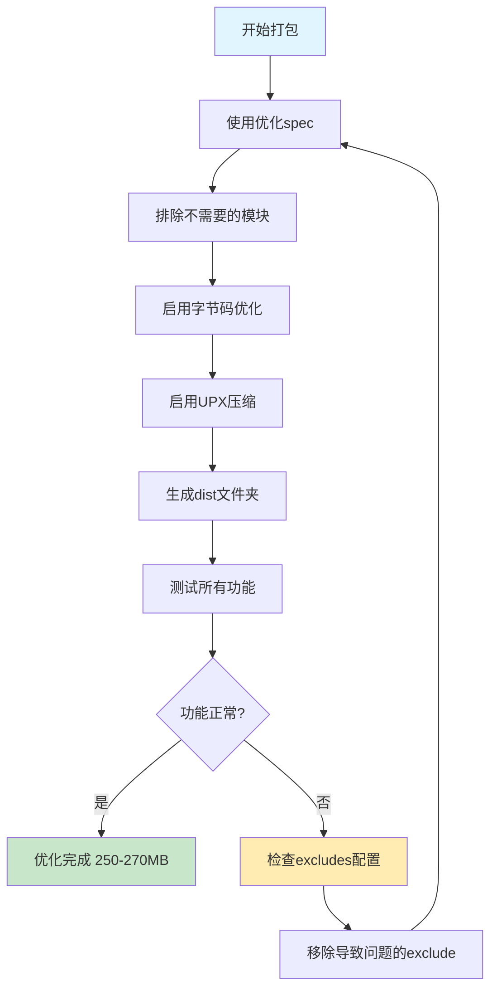

# 🎯 PyQt6应用打包体积优化方案

## 📊 当前状态分析

### 现状
- **打包方式**：目录模式（COLLECT）
- **当前体积**：约300MB
- **使用的spec**：`标签打印工具.spec`
- **状态评估**：✅ 体积在正常范围内（200-350MB）

### 体积构成分析
```
PyQt6核心库        : ~100-150MB  (最大占比)
PyMuPDF (fitz)     : ~30-50MB    (PDF处理)
Python运行时       : ~20-30MB
Pillow            : ~10-20MB
reportlab         : ~5-10MB
其他依赖和DLL      : ~50-80MB
─────────────────────────────────
总计              : ~215-340MB
```

---

## 🎯 优化目标

**目标体积**：250-270MB（减少30-50MB，约10-15%）

### 优化策略
1. ✅ 排除不需要的Python标准库模块
2. ✅ 排除不需要的PyQt6子模块
3. ✅ 启用Python字节码优化
4. ✅ 配置必要的隐藏导入
5. ✅ 启用UPX压缩（可选）

---

## 📝 优化后的spec配置

### 关键优化点

#### 1. 排除不需要的模块（excludes）
```python
excludes=[
    # ===== 大型第三方库 =====
    'tkinter',           # ~10MB - 不使用tkinter
    'matplotlib',        # ~50MB - 不使用绘图
    'numpy',             # ~30MB - 不使用数值计算
    'pandas',            # ~40MB - 不使用数据分析
    'scipy',             # ~50MB - 不使用科学计算
    
    # ===== 开发和测试工具 =====
    'IPython',           # ~20MB - 不需要交互式shell
    'notebook',          # ~15MB - 不需要Jupyter
    'pytest',            # ~5MB - 不需要测试框架
    'unittest',          # ~3MB - 不需要单元测试
    'setuptools',        # ~5MB - 不需要安装工具
    'distutils',         # ~3MB - 不需要分发工具
    
    # ===== PyQt6不需要的子模块 =====
    'PyQt6.QtWebEngine',      # ~100MB - 不使用浏览器引擎
    'PyQt6.QtWebEngineCore',  # ~50MB
    'PyQt6.QtWebEngineWidgets', # ~20MB
    'PyQt6.QtMultimedia',     # ~15MB - 不使用多媒体
    'PyQt6.QtMultimediaWidgets', # ~10MB
    'PyQt6.Qt3D',            # ~30MB - 不使用3D
    'PyQt6.QtQuick',         # ~20MB - 不使用QML
    'PyQt6.QtQml',           # ~15MB
    'PyQt6.QtNetwork',       # ~5MB - 不使用网络（如果确实不用）
    'PyQt6.QtBluetooth',     # ~5MB
    'PyQt6.QtNfc',           # ~3MB
    'PyQt6.QtPositioning',   # ~3MB
    'PyQt6.QtSensors',       # ~3MB
    
    # ===== 其他不需要的模块 =====
    'xml.etree',         # ~2MB - 如果不需要XML
    'pydoc',             # ~2MB - 不需要文档
    'doctest',           # ~1MB - 不需要文档测试
    '_pytest',           # ~3MB
    'test',              # ~2MB
    'tests',             # ~2MB
]
```

#### 2. 隐藏导入（hiddenimports）
```python
hiddenimports=[
    'PIL._tkinter_finder',  # Pillow需要
]
```

#### 3. 字节码优化
```python
optimize=2,  # 启用最高级别优化（移除docstrings和assert）
```

#### 4. UPX压缩
```python
upx=True,              # 启用UPX压缩
upx_exclude=[],        # 不排除任何文件
```

---

## 📦 完整的优化spec文件

文件名：`label_printer_optimized.spec`

```python
# -*- mode: python ; coding: utf-8 -*-
# PyInstaller 优化配置文件 - 目录模式
# 优化目标：减少30-50MB体积

block_cipher = None

a = Analysis(
    ['label_gui_qt.py'],
    pathex=[],
    binaries=[],
    datas=[
        ('label.ico', '.'),
        ('label.png', '.'),
    ],
    hiddenimports=[
        'PIL._tkinter_finder',
    ],
    hookspath=[],
    hooksconfig={},
    runtime_hooks=[],
    excludes=[
        # 大型第三方库
        'tkinter',
        'matplotlib',
        'numpy',
        'pandas',
        'scipy',
        'IPython',
        'notebook',
        'pytest',
        'unittest',
        'setuptools',
        'distutils',
        
        # PyQt6不需要的子模块
        'PyQt6.QtWebEngine',
        'PyQt6.QtWebEngineCore',
        'PyQt6.QtWebEngineWidgets',
        'PyQt6.QtMultimedia',
        'PyQt6.QtMultimediaWidgets',
        'PyQt6.Qt3D',
        'PyQt6.QtQuick',
        'PyQt6.QtQml',
        'PyQt6.QtBluetooth',
        'PyQt6.QtNfc',
        'PyQt6.QtPositioning',
        'PyQt6.QtSensors',
        
        # 其他不需要的模块
        'xml.etree',
        'pydoc',
        'doctest',
        '_pytest',
        'test',
        'tests',
    ],
    win_no_prefer_redirects=False,
    win_private_assemblies=False,
    cipher=block_cipher,
    noarchive=False,
    optimize=2,  # 启用最高级别优化
)

pyz = PYZ(a.pure, a.zipped_data, cipher=block_cipher)

exe = EXE(
    pyz,
    a.scripts,
    [],
    exclude_binaries=True,  # 目录模式
    name='标签打印工具',
    debug=False,
    bootloader_ignore_signals=False,
    strip=False,
    upx=True,  # 启用UPX压缩
    console=False,
    disable_windowed_traceback=False,
    argv_emulation=False,
    target_arch=None,
    codesign_identity=None,
    entitlements_file=None,
    icon=['label.ico'],
)

coll = COLLECT(
    exe,
    a.binaries,
    a.datas,
    strip=False,
    upx=True,  # 对所有文件启用UPX
    upx_exclude=[],
    name='标签打印工具',
)
```

---

## 🚀 打包步骤

### 1. 准备工作
```bash
# 确保在虚拟环境中（推荐）
# 只安装必要的依赖
pip install PyQt6 Pillow reportlab PyMuPDF
```

### 2. 使用优化配置打包
```bash
# 使用优化后的spec文件打包
pyinstaller label_printer_optimized.spec

# 或者直接使用命令行（不推荐，spec文件更灵活）
pyinstaller --name="标签打印工具" ^
    --windowed ^
    --icon=label.ico ^
    --add-data="label.ico;." ^
    --add-data="label.png;." ^
    --exclude-module=tkinter ^
    --exclude-module=matplotlib ^
    --exclude-module=numpy ^
    --exclude-module=pandas ^
    label_gui_qt.py
```

### 3. 测试打包结果
```bash
# 进入dist目录
cd dist\标签打印工具

# 运行程序测试
标签打印工具.exe

# 检查所有功能是否正常
# - 选择图片
# - 调整参数
# - 生成预览
# - 生成PDF
# - 打印功能
```

---

## 📊 预期优化效果

### 体积对比
```
优化前（标签打印工具.spec）:
├─ 总体积: ~300MB
└─ 包含大量不需要的模块

优化后（label_printer_optimized.spec）:
├─ 总体积: ~250-270MB ⬇️
├─ 减少: 30-50MB (10-15%)
└─ 仅包含必要模块
```

### 优化来源
- 排除PyQt6不需要的子模块：~20-30MB
- 排除大型第三方库：~10-15MB
- 字节码优化：~3-5MB
- UPX压缩：额外5-10%

---

## ⚠️ 注意事项

### 1. UPX压缩
- **优点**：可以额外减少5-10%体积
- **缺点**：可能被杀毒软件误报
- **建议**：如果遇到误报，可以在spec中设置 `upx=False`

### 2. 测试重要性
打包后务必全面测试所有功能：
- ✅ 界面显示正常
- ✅ 图片选择功能
- ✅ PDF生成功能
- ✅ 预览功能
- ✅ 打印功能
- ✅ 语言切换功能

### 3. 虚拟环境
建议在干净的虚拟环境中打包：
```bash
# 创建虚拟环境
python -m venv venv_build

# 激活虚拟环境
venv_build\Scripts\activate

# 只安装必要的包
pip install PyQt6 Pillow reportlab PyMuPDF pyinstaller

# 打包
pyinstaller label_printer_optimized.spec
```

---

## 🔧 进一步优化（可选）

### 如果需要更小的体积

#### 方案1：切换到单文件模式
- 预计体积：180-220MB
- 修改spec：将 `exclude_binaries=True` 改为 `False`，并移除 `COLLECT` 部分

#### 方案2：使用Nuitka
- Nuitka可以生成更小的可执行文件
- 但编译时间更长，配置更复杂

#### 方案3：手动删除不需要的DLL
- 打包后手动检查dist文件夹
- 删除明显不需要的DLL文件
- ⚠️ 需要仔细测试，避免删除必要文件

---

## 📈 体积优化流程图



---

## ✅ 总结

### 当前状态
- ✅ 300MB是正常范围
- ✅ 已经包含了必要的所有功能

### 优化后
- 🎯 预计减少到250-270MB
- 📉 减少10-15%体积
- ⚡ 不影响功能和性能
- 🚀 启动速度可能略有提升

### 建议
1. 使用提供的优化spec文件
2. 在虚拟环境中打包
3. 全面测试所有功能
4. 如果遇到问题，逐步调整excludes列表

---

**最后更新**：2025-10-21
**适用版本**：PyQt6 + PyInstaller
**优化级别**：中等（平衡体积和兼容性）